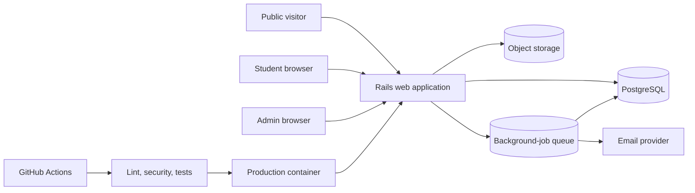

# Bootcamper MVP Architecture

## Scope

The MVP is a responsive Ukrainian-language Rails application for public course discovery, student applications, learning content, progress tracking, practical submissions, reviews, calendars, and administration. It supports multiple courses and cohorts, while a student may enroll in more than one course.

Badges, messaging, GitHub synchronization, automated tests/interview admission stages, social login, public showcases, admin impersonation, and the guide character remain outside the MVP. Their boundaries and sequencing are defined in [Post-MVP Architecture Roadmap](post-mvp-roadmap.md).

## Architectural Decisions

- **Modular Rails monolith:** one deployable application, with domain-oriented models, controllers, services, policies, and tests. Do not introduce microservices.
- **PostgreSQL:** source of truth for users, admissions, course structure, submissions, and progress.
- **Hotwire and Stimulus:** server-rendered interactions with small JavaScript controllers. Avoid a separate frontend application.
- **Action Text and Active Storage:** rich lesson content and attachments. Use direct uploads with type and size validation.
- **Background jobs:** deliver email and calculate scheduled reminders outside web requests.
- **RSpec:** model, request, job, mailer, policy, and browser-level system tests.
- **I18n from day one:** Ukrainian is the initial locale; user-facing copy must not be embedded directly in Ruby classes.
- **Accessible theming:** light and dark themes share semantic design tokens and honor reduced-motion settings.

## Runtime View

## Domain Boundaries

| Domain | Primary records | Responsibility |
| --- | --- | --- |
| Identity | `User`, `StudentProfile`, `EmailVerification` | Sign-in, roles, verification, profile visibility |
| Catalog | `Course`, `Cohort`, `Enrollment`, `Invitation` | Public discovery and course membership |
| Admissions | `ApplicationForm`, `ApplicationQuestion`, `CourseApplication`, `ApplicationAnswer` | Custom application forms and decisions |
| Learning | `CourseModule`, `Lesson`, `Material`, `LessonPrerequisite`, `AccessOverride` | Authoring, publishing, ordering, and access |
| Progress | `MaterialProgress`, `Attendance`, `Deadline` | Completion state, next steps, and at-risk signals |
| Practice | `Assignment`, `Submission`, `SubmissionItem`, `Review`, `FeedbackComment` | Individual/pair/team work and review workflow |
| Calendar | `CalendarEvent` | Course dates, deadlines, lessons, and interviews |
| Notifications | `Notification`, `NotificationPreference` | In-app and email delivery |

Use explicit service objects for state transitions such as accepting an application, publishing a lesson, submitting work, and approving a review. Database constraints must protect uniqueness and valid ownership; controller validation alone is insufficient.

## Key Access Rules

- Public visitors can browse published courses without an account.
- Only verified students can apply.
- Students see only courses they are enrolled in and applications they own.
- All admins have equal access to the separate `/admin` workspace.
- Published lessons are blocked until prerequisites and release rules pass; an admin may grant a reasoned per-student override.
- Submitted work cannot change while under review. A reviewer may request changes, after which a new revision is allowed.
- Work cannot be submitted after its deadline unless an admin grants a scoped extension.
- Profile fields have private, cohort/team, and public visibility. Public profile publication requires student opt-in and admin approval.

## Deployment Shape

Development uses Docker Compose for the Rails app and PostgreSQL. Production uses one container image for web and worker process types, managed PostgreSQL, object storage, HTTPS, and an email provider. Start on a simple container platform; AWS migration is explicitly post-MVP. Production readiness requires automated backups, health checks, error reporting, structured logs, and a documented restore/rollback exercise.
