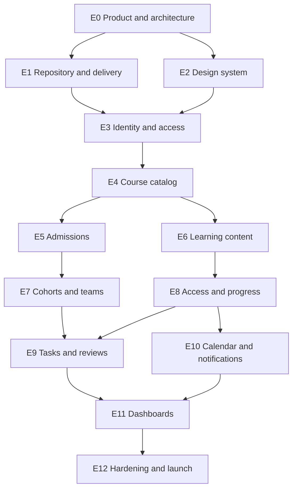

# Bootcamper MVP Backlog

## Working Agreement

This backlog covers the agreed first release. Each ticket is intended to take no more than two ideal engineering days. If implementation exceeds that limit, stop and split the ticket before continuing. Estimates are planning ranges, not deadlines.

Every ticket is complete only when its acceptance criteria pass, relevant RSpec coverage is added, Ukrainian copy is localized, keyboard/mobile behavior is checked, and the pull request is reviewed. No direct commits go to `main`.

## Execution Map

Recommended delivery waves:

1. **Foundation:** E0–E3 produces a deployed, tested sign-in shell.
2. **Admission slice:** E4–E5 lets a real student discover, apply, and receive a decision.
3. **Learning slice:** E6–E8 lets an enrolled student open a lesson and record progress.
4. **Practice slice:** E7 and E9 completes submission and review.
5. **Operational slice:** E10–E12 adds dashboards, reminders, hardening, and launch.

## Epic Estimate

| Epic | Tickets | Ideal days |
| --- | ---: | ---: |
| E0 Product and architecture | 5 | 3.5 |
| E1 Repository and delivery | 9 | 9.0 |
| E2 Design system | 7 | 9.5 |
| E3 Identity and access | 12 | 16.0 |
| E4 Course catalog | 8 | 10.0 |
| E5 Admissions | 14 | 19.0 |
| E6 Learning content | 10 | 16.0 |
| E7 Cohorts and teams | 5 | 5.5 |
| E8 Access and progress | 12 | 16.0 |
| E9 Tasks and reviews | 13 | 16.5 |
| E10 Calendar and notifications | 9 | 13.5 |
| E11 Dashboards | 7 | 12.0 |
| E12 Hardening and launch | 12 | 17.0 |
| **Total** | **123** | **163.5** |

These are uncalibrated ideal-day estimates and exclude product review, student/teacher usability feedback, and contingency. After the first sprint, replace them with the team's observed throughput. At this size, the agreed feature set is a substantial Release 1 rather than a lean MVP; schedule a scope checkpoint after the first admission slice.

## E0 — Product and Architecture

| ID | Ticket and measurable acceptance | Depends | Estimate |
| --- | --- | --- | --- |
| E0-01 | **Freeze the MVP scope.** Add an in-scope/out-of-scope section to the product README; product owner approves it before feature work starts. | — | 0.5d |
| E0-02 | **Record architecture decisions.** Add ADRs for modular monolith, Hotwire, PostgreSQL, RSpec, file storage, and job processing; each states context, decision, and consequence. | E0-01 | 1d |
| E0-03 | **Create the domain glossary.** Define course, cohort, enrollment, team, module, lesson, material, assignment, submission, and review; no term has two meanings. | E0-01 | 0.5d |
| E0-04 | **Approve the MVP data map.** Draw the entity relationships and validate multi-course enrollment, permanent teams, pair work, and prerequisite overrides with three example scenarios. | E0-03 | 1d |
| E0-05 | **Define release success measures.** Record target flows: application, first lesson completion, on-time submission, completed review, and mobile use; define how each is measured without collecting unnecessary personal data. | E0-01 | 0.5d |

## E1 — Repository, Local Development, and Delivery

| ID | Ticket and measurable acceptance | Depends | Estimate |
| --- | --- | --- | --- |
| E1-01 | **Initialize Rails.** Generate the Rails app with PostgreSQL, Hotwire, and a pinned Ruby version; the home page starts locally and the initial test suite passes. | E0-02 | 1d |
| E1-02 | **Create local configuration.** Commit `.env.example` with names only, document setup, and make the app fail clearly when a required variable is missing. | E1-01 | 0.5d |
| E1-03 | **Add Docker development services.** Add `Dockerfile`, `compose.yml`, app, and PostgreSQL services; a fresh machine reaches the home page using documented commands. | E1-01 | 1.5d |
| E1-04 | **Make database setup repeatable.** `bin/setup` installs dependencies, prepares the database, and seeds one development admin without duplicating records on a second run. | E1-02 | 1d |
| E1-05 | **Install the test stack.** Configure RSpec, Factory Bot, request specs, and system specs; one example of each type passes locally. | E1-01 | 1d |
| E1-06 | **Add quality gates.** Configure RuboCop, Brakeman, dependency audit, and ERB linting; one documented command runs all checks with zero warnings. | E1-01 | 1d |
| E1-07 | **Create pull-request CI.** GitHub Actions runs database setup, unit/request specs, system specs, linting, and security scans; a failing check blocks the merge job. | E1-05, E1-06 | 1.5d |
| E1-08 | **Build the production image.** CI builds the Docker image from a clean checkout and performs a boot smoke test with production-like settings. | E1-03, E1-07 | 1d |
| E1-09 | **Add developer commands.** Provide `bin/dev`, `bin/test`, and `bin/quality`; README explains each and a new contributor can complete setup without undocumented steps. | E1-04, E1-06 | 0.5d |

## E2 — Responsive Steampunk Design System

| ID | Ticket and measurable acceptance | Depends | Estimate |
| --- | --- | --- | --- |
| E2-01 | **Create visual foundations.** Define semantic tokens for warm ivory, ink blue, copper, oxidized teal, spacing, type, radius, shadow, and motion in Figma and CSS. | E0-01 | 1.5d |
| E2-02 | **Build light and dark themes.** Both themes pass WCAG AA contrast for normal text, persist the user choice, and default to the operating-system preference. | E2-01 | 1d |
| E2-03 | **Build the responsive application shell.** Desktop side navigation and mobile bottom navigation expose Home, Workshop, Tasks, Team, Calendar, and Profile at 360px and 1280px widths. | E2-01 | 1.5d |
| E2-04 | **Build shared UI primitives.** Add documented button, input, select, checkbox, card, badge, alert, modal, tabs, empty-state, and pagination partials with keyboard-visible focus. | E2-01 | 2d |
| E2-05 | **Define the workshop map language.** Produce one simple graphic map prototype with module stations, locked/current/completed states, and team accent colors; usability-check it with three users. | E2-01 | 1.5d |
| E2-06 | **Respect accessibility preferences.** Disable decorative animation under `prefers-reduced-motion`, provide text equivalents for map state, and verify navigation without a mouse. | E2-03, E2-05 | 1d |
| E2-07 | **Add visual regression pages.** Create an internal component gallery covering both themes, validation, loading, empty, and error states. | E2-02, E2-04 | 1d |

## E3 — Identity, Profiles, and Access

| ID | Ticket and measurable acceptance | Depends | Estimate |
| --- | --- | --- | --- |
| E3-01 | **Create user roles.** Add student/admin users with database-enforced email uniqueness and a role constraint; tests prove roles cannot be combined. | E1-05 | 1d |
| E3-02 | **Register a student.** A visitor can create a student account using email and password; invalid and duplicate values show localized errors. | E3-01, E2-04 | 1d |
| E3-03 | **Verify email ownership.** Registration sends an expiring, single-use verification link; unverified users cannot apply to courses. | E3-02 | 1.5d |
| E3-04 | **Sign in and sign out.** Verified users can create and end sessions; protected pages redirect anonymous visitors to sign-in and return them afterward. | E3-02 | 1d |
| E3-05 | **Reset a forgotten password.** A user receives an expiring reset link without revealing whether an email exists; using it invalidates existing sessions. | E3-04 | 1.5d |
| E3-06 | **Separate the admin workspace.** `/admin` rejects students and anonymous users; an admin lands on an empty overview page using the shared design system. | E3-01, E2-03 | 1d |
| E3-08 | **Edit a student profile.** Students can save optional display name, avatar, skills, interests, GitHub URL, and profile URLs with format and upload validation. | E3-04 | 1.5d |
| E3-09 | **Control field visibility.** Each profile field supports private, team/cohort, or public visibility; request specs cover every audience. | E3-08 | 1.5d |
| E3-10 | **Approve public profiles.** Public display is disabled by default and becomes visible only after student opt-in and admin approval; it uses `Display Name (Full Name)`, and rejected edits return it to pending. | E3-09, E3-06 | 1.5d |
| E3-11 | **Deactivate a student account.** A student can confirm deactivation; sign-in stops immediately while authored course records remain attributed internally. | E3-04 | 1d |
| E3-12 | **Anonymize an account.** After a second confirmation, a background job removes profile data and replaces identity fields while preserving required team/submission history. | E3-11 | 2d |

## E4 — Public Course Catalog and Enrollment Model

| ID | Ticket and measurable acceptance | Depends | Estimate |
| --- | --- | --- | --- |
| E4-01 | **Create courses.** Admins can draft a course with Ukrainian title, summary, description, application window, and cover graphic; drafts are not public. | E3-06 | 1.5d |
| E4-02 | **Publish a course.** Admins can publish/unpublish a valid course; public pages show only published courses and return 404 for drafts. | E4-01 | 1d |
| E4-03 | **Browse the catalog.** Visitors can view open, upcoming, and archived courses with empty states and pagination on mobile and desktop. | E4-02, E2-03 | 1.5d |
| E4-04 | **View course details.** The public page displays description, dates, application state, workload, and sign-in/apply call to action. | E4-02 | 1d |
| E4-05 | **Create cohorts.** Admins can add multiple dated cohorts to a course and close enrollment independently for each cohort. | E4-01 | 1d |
| E4-06 | **Create enrollments.** Acceptance creates one unique active enrollment for the selected course/cohort; the same student may enroll in another course. | E4-05 | 1d |
| E4-07 | **Archive completed access.** An ended enrollment moves to read-only archive mode while published materials and prior submissions remain readable. | E4-06 | 1.5d |
| E4-08 | **Duplicate a course shell.** An admin can copy course metadata and selected configuration into a new draft without sharing mutable records. | E4-01 | 1.5d |

## E5 — Custom Applications and Decisions

| ID | Ticket and measurable acceptance | Depends | Estimate |
| --- | --- | --- | --- |
| E5-01 | **Create an application form.** An admin creates one draft form per course/cohort and can add, edit, reorder, require, or remove unanswered questions. | E4-05 | 1.5d |
| E5-02 | **Support text questions.** Short text, long text, number, and date answers render and validate their configured constraints. | E5-01 | 1.5d |
| E5-03 | **Support choice questions.** Single- and multiple-choice answers use admin-defined options and reject values that are no longer valid. | E5-01 | 1d |
| E5-04 | **Support application uploads.** File questions enforce configured file types and sizes, scan/validate before download, and are admin-only. | E5-01, E1-03 | 1.5d |
| E5-05 | **Publish the application form.** An admin previews and publishes a valid form; edits after the first submission create a new immutable form version. | E5-02, E5-03, E5-04 | 2d |
| E5-06 | **Save an application draft.** A verified student can start, save, resume, and edit one application until submission. | E5-05, E3-03 | 1.5d |
| E5-07 | **Submit an application.** Required answers are validated in one transaction; the submitted version becomes read-only and records the submission time. | E5-06 | 1d |
| E5-08 | **Review the application queue.** Admins can filter pending/accepted/rejected applications and open answers and attachments without exposing private notes. | E5-07 | 1.5d |
| E5-09 | **Record private admin notes.** Admins can add timestamped internal notes; students never receive them in HTML, email, or serialized responses. | E5-08 | 1d |
| E5-10 | **Accept an applicant.** Acceptance records the acting admin/time, creates the enrollment exactly once, and emails the student. | E5-08, E4-06 | 1.5d |
| E5-11 | **Reject an applicant.** Rejection requires a student-visible reason, emails it, and follows the course’s allow-reapplication setting. | E5-08 | 1.5d |
| E5-12 | **Reapply when permitted.** An eligible rejected student starts a fresh application linked to the previous attempt; ineligible students see the rejection state only. | E5-11 | 1d |
| E5-13 | **Invite a student to apply.** Admins send an expiring course-specific link; it pre-fills the invited email and still requires verification and application by default. | E5-05, E3-03 | 1.5d |
| E5-14 | **Configure auto-accept invitations.** Admins can explicitly mark an invitation as direct enrollment; consuming it creates one enrollment and clearly warns the admin before sending. | E5-13, E4-06 | 1d |

## E6 — Course Structure and Learning Materials

| ID | Ticket and measurable acceptance | Depends | Estimate |
| --- | --- | --- | --- |
| E6-01 | **Create ordered modules.** Admins can add, rename, reorder, and draft modules within a course; students see published modules only. | E4-01 | 1d |
| E6-02 | **Create leveled lessons.** Admins create Core, Stretch, or Deep Dive lessons with title, summary, estimated time, and draft/published state. | E6-01 | 1.5d |
| E6-03 | **Compose native lesson content.** Admins create rich text with headings, lists, links, images, callouts, and syntax-highlighted code; unsafe HTML is sanitized. | E6-02 | 2d |
| E6-04 | **Attach learning resources.** A lesson accepts ordered PDF, video, YouTube/external link, download, and optional-material entries with labels. | E6-02 | 1.5d |
| E6-05 | **Read a lesson responsively.** Students get a distraction-light reader with table of contents, previous/next navigation, and usable layouts at 360px and 1280px. | E6-03, E6-04, E2-03 | 2d |
| E6-06 | **Configure material completion.** Each material uses manual, viewed, or admin-approved completion; tests prove only the configured trigger marks completion. | E6-04 | 1.5d |
| E6-07 | **Publish content immediately.** Publishing validates required fields and makes the lesson available according to access rules without a scheduler. | E6-02 | 1d |
| E6-08 | **Restore a lesson revision.** Each published edit stores author/time and restorable content; restoring creates a new revision rather than deleting history. | E6-03, E6-07 | 2d |
| E6-09 | **Duplicate learning content.** Admins can duplicate modules, lessons, and materials as independent draft records within or between courses. | E6-04 | 1.5d |
| E6-10 | **Render the workshop map.** Enrolled students see one large graphic workshop with ordered module stations and accessible locked/current/completed states. | E6-01, E2-05 | 2d |

## E7 — Cohorts, Permanent Teams, and Pairs

| ID | Ticket and measurable acceptance | Depends | Estimate |
| --- | --- | --- | --- |
| E7-01 | **Create a permanent team.** Admins add a team to a cohort with unique name, emblem, and accessible accent color. | E4-05 | 1d |
| E7-02 | **Assign team members.** Admins add/remove enrolled students; a student has at most one permanent team per cohort. | E7-01, E4-06 | 1d |
| E7-03 | **Create temporary groups.** Admins create dated groups for an activity; membership may overlap permanent teams and other groups. | E7-02 | 1d |
| E7-04 | **Assign rotating pairs.** Admins create a two-person group with start/end dates; validation prevents one-person or three-person pairs. | E7-03 | 1d |
| E7-05 | **View the team page.** Members and admins see emblem, roster, current pairs/groups, shared milestones, and configured team-visible progress. | E7-02, E3-09 | 1.5d |

## E8 — Access, Progress, Attendance, and Deadlines

| ID | Ticket and measurable acceptance | Depends | Estimate |
| --- | --- | --- | --- |
| E8-01 | **Define lesson prerequisites.** Admins select prerequisite lessons and release dates; validation prevents cycles and cross-course links. | E6-02 | 1.5d |
| E8-02 | **Enforce lesson access.** Students cannot open blocked lessons; the UI explains the unmet prerequisite or opening date without exposing content. | E8-01, E4-06 | 1.5d |
| E8-03 | **Grant an access override.** An admin grants a student access with a required reason; the exception is visible on that student’s admin view. | E8-02 | 1d |
| E8-04 | **Track material progress.** Completion records are unique per enrollment/material, timestamped, and update when the configured completion action occurs. | E6-06, E4-06 | 1.5d |
| E8-05 | **Calculate lesson state.** A lesson is not-started, in-progress, or completed from its required materials; optional materials do not block completion. | E8-04 | 1d |
| E8-06 | **Show separate progress dimensions.** Student progress displays learning, practice, attendance, and team delivery independently, never as one combined score. | E8-05 | 1.5d |
| E8-07 | **Record attendance manually.** Admins mark present, absent, late, or excused for a scheduled session and can correct the record. | E4-06 | 1.5d |
| E8-08 | **Import an attendance event.** Provide an authenticated service endpoint and idempotency key for future meeting integrations; request specs prove duplicate events do not duplicate attendance. | E8-07 | 1.5d |
| E8-09 | **Create scoped deadlines.** Admins assign a deadline to a course, lesson, or assignment and see it in the enrolled student’s timezone. | E6-02 | 1d |
| E8-10 | **Grant a deadline extension.** Admins extend a deadline globally or for one student/pair/team with a required reason; unaffected learners retain the original date. | E8-09, E7-04 | 1.5d |
| E8-11 | **Derive next steps.** The service returns the nearest available incomplete Core lesson, required task, or resubmission, ordered by due date. | E8-02, E8-05, E8-09 | 1.5d |
| E8-12 | **Configure teammate visibility.** Admins enable/disable teammate progress per cohort; disabled data is absent from both pages and responses. | E7-05, E8-06 | 1d |

## E9 — Practical Tasks, Submission Revisions, and Reviews

| ID | Ticket and measurable acceptance | Depends | Estimate |
| --- | --- | --- | --- |
| E9-01 | **Create an assignment.** Admins add instructions, deadline, allowed submission components, ownership mode, and optional review criteria to a lesson. | E6-02, E8-09 | 1.5d |
| E9-02 | **Configure submission components.** Text, file, checklist, GitHub URL, and external URL components can be combined, ordered, and required independently. | E9-01 | 1.5d |
| E9-03 | **Assign task ownership.** An assignment targets an individual, configured pair/group, or permanent team; invalid ownership combinations are rejected. | E9-01, E7-04 | 1d |
| E9-04 | **Save a submission draft.** Eligible owners can save and resume answers and uploads before the effective deadline. | E9-02, E9-03 | 1.5d |
| E9-05 | **Submit work on time.** Submission validates all required components in one transaction, records a frozen revision, and rejects attempts after the effective deadline. | E9-04, E8-10 | 1.5d |
| E9-06 | **Assign a reviewer.** An admin assigns another admin as reviewer for a submitted revision; the assignee sees it in their review queue. | E9-05, E3-06 | 1d |
| E9-07 | **Start a review.** The assigned reviewer moves `submitted` to `in_review`; other reviewers receive read-only access until reassigned. | E9-06 | 1d |
| E9-08 | **Add written feedback.** The reviewer adds overall feedback and criterion-specific comments; drafts remain private until the decision is submitted. | E9-07 | 1.5d |
| E9-09 | **Request changes.** A reviewer provides required feedback and moves the work to `changes_requested`; owners receive read access to feedback and may create a new revision. | E9-08 | 1d |
| E9-10 | **Resubmit revised work.** Owners copy the previous revision into an editable draft, change it, and resubmit before the effective deadline or extension. | E9-09 | 1.5d |
| E9-11 | **Approve work.** A reviewer moves the current revision to `approved`; it becomes read-only and updates the practice progress dimension. | E9-08, E8-06 | 1d |
| E9-12 | **Show submission history.** Students and admins see each revision, state transition, reviewer, decision time, and released feedback in chronological order. | E9-09, E9-11 | 1.5d |
| E9-13 | **Duplicate an assignment.** Admins copy instructions, components, and criteria into a new draft without submissions or reviews. | E9-02 | 1d |

## E10 — Calendar and Notifications

| ID | Ticket and measurable acceptance | Depends | Estimate |
| --- | --- | --- | --- |
| E10-01 | **Create calendar events.** Admins add lesson, lab, interview, or general events scoped to a course/cohort/team with start/end times and optional links. | E4-05, E7-01 | 1.5d |
| E10-02 | **Show a unified calendar.** Students see authorized events, release dates, and effective deadlines in month/list views; mobile defaults to the list. | E10-01, E8-09 | 2d |
| E10-03 | **Create in-app notifications.** Store typed notifications with target URL, unread/read state, recipient, and event timestamp; the header shows unread count. | E3-04 | 1.5d |
| E10-04 | **Notify application decisions.** Accept/reject actions create in-app and email messages with no private admin notes. | E10-03, E5-10, E5-11 | 1d |
| E10-05 | **Notify learning and review events.** New lesson availability, submission, changes requested, approval, and calendar changes use tested notification templates. | E10-03, E6-07, E9-11 | 1.5d |
| E10-06 | **Send deadline reminders.** A recurring job sends idempotent reminders three days and one day before each learner’s effective deadline. | E10-03, E8-10 | 1.5d |
| E10-07 | **Manage notification preferences.** Students configure channel preferences for optional events; verification, security, application decisions, and deadline notices remain mandatory. | E10-03 | 1.5d |
| E10-08 | **Send a digest.** Students choose daily or weekly summaries; one job groups unread optional events and never duplicates an event in the same digest period. | E10-07 | 1.5d |
| E10-09 | **Notify admins.** Admins receive configurable alerts for new applications, submissions awaiting review, and students flagged as falling behind. | E10-03, E5-07, E9-05 | 1.5d |

## E11 — Student and Admin Dashboards

| ID | Ticket and measurable acceptance | Depends | Estimate |
| --- | --- | --- | --- |
| E11-01 | **Build Student Home.** The default page shows course selector, current lesson, next step, approaching deadlines, recent feedback, team activity summary, and progress dimensions. | E8-11, E9-12, E10-02 | 2d |
| E11-02 | **Switch active courses.** A student enrolled in two courses can switch context globally; the choice persists and never exposes another enrollment. | E4-06, E11-01 | 1d |
| E11-03 | **Build the Tasks page.** Students filter draft, due, in-review, changes-requested, and approved work across courses. | E9-12 | 1.5d |
| E11-04 | **Build Admin Overview.** Show counts and links for pending applications, review queue, at-risk students, upcoming dates, recent activity, and cohort progress. | E5-08, E8-06, E9-06, E10-02 | 2d |
| E11-05 | **Define the at-risk rule.** Flag students with an overdue Core requirement, two missed sessions, or no progress for a configurable number of days; admins can filter by reason. | E8-06, E8-07, E8-09 | 1.5d |
| E11-06 | **Build internal reports.** Admins filter course/cohort progress, attendance, applications, and review turnaround on screen; no CSV/PDF export exists. | E11-04 | 2d |
| E11-07 | **Test critical responsive journeys.** System specs cover application, lesson completion, submission/review, and dashboard at desktop and 375px mobile widths. | E11-01, E11-04 | 2d |

## E12 — Security, Operations, and Launch

| ID | Ticket and measurable acceptance | Depends | Estimate |
| --- | --- | --- | --- |
| E12-01 | **Harden authorization.** Add policy coverage for visitor/student/admin and cross-course access; mutation testing checklist finds no unprotected MVP controller action. | E11-07 | 2d |
| E12-02 | **Harden uploads.** Enforce allowlisted types/sizes, randomized storage keys, private delivery, and malware-scan hook; rejected files never become downloadable. | E5-04, E6-04, E9-04 | 1.5d |
| E12-03 | **Add abuse protection.** Rate-limit sign-in, password reset, registration, application submission, and invitation endpoints; tests assert throttled responses. | E3-05, E5-13 | 1.5d |
| E12-04 | **Protect sensitive data.** Filter secrets and answers from logs, set secure cookie and HTTPS policies, and document credential rotation. | E1-08, E5-07 | 1d |
| E12-05 | **Create staging.** Deploy web and worker processes with managed PostgreSQL, private object storage, email sandbox, HTTPS, and seed-free configuration. | E1-08, E10-06 | 2d |
| E12-06 | **Add health and error monitoring.** Expose liveness/readiness checks, report uncaught exceptions, and alert when web or worker checks fail. | E12-05 | 1d |
| E12-07 | **Configure backups.** Enable daily database backups and object-storage retention; complete and record one restore into an isolated environment. | E12-05 | 1.5d |
| E12-08 | **Automate deployment.** A tagged release deploys after CI, runs migrations once, verifies health, and documents rollback to the previous image. | E12-05, E12-06 | 1.5d |
| E12-09 | **Run accessibility and browser QA.** Critical flows pass keyboard, screen-reader smoke, contrast, reduced-motion, current Chrome/Safari/Firefox, iOS Safari, and Android Chrome checks. | E11-07 | 2d |
| E12-10 | **Run a pilot acceptance test.** One admin and two student accounts complete catalog-to-approved-review on staging; all blocking defects are resolved or explicitly waived. | E12-08, E12-09 | 1.5d |
| E12-11 | **Publish the operating runbook.** Document deploy, rollback, restore, account support, failed jobs, email failure, and incident contacts; another operator follows one scenario successfully. | E12-07, E12-08 | 1d |
| E12-12 | **Launch the MVP.** Production smoke tests pass, monitoring and backups are green, the first course is published, and the product owner signs off. | E12-10, E12-11 | 0.5d |

## Post-MVP Epics

The architecture and sequencing for deferred capabilities live in [Post-MVP Architecture Roadmap](post-mvp-roadmap.md). Keep these out of MVP tickets unless the product owner explicitly changes scope:

- Badge rules, levels, secret badges, and non-competitive recognition
- Course/team/direct/task messaging with ten-second refresh
- Automatically and manually graded admission tests and interview states
- GitHub PR, check, and review synchronization
- Google/GitHub linked sign-in
- External attendance-provider integrations
- Public student project showcases and course archives
- Richer reports and notification tuning
- Admin “view as student”
- Guide character and product tour
- AWS migration and later production-engineering exercises

## Suggested First Sprint Goal

**Goal:** A contributor can run the application locally and CI validates a responsive, themed public shell.

Commit only E0-01 through E0-04, E1-01 through E1-07, and E2-01 through E2-04 to this sprint. Do not start authentication until the foundation, design tokens, test harness, and CI are accepted.
