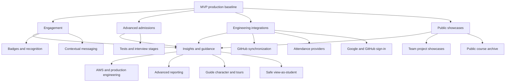

# Bootcamper Post-MVP Architecture Roadmap

## Purpose

This document preserves functionality intentionally deferred from the MVP. It describes architectural direction and release order, not implementation tickets. Convert a capability into SMART tickets only after the preceding release is operating in production and its assumptions have been validated with students and admins.

## Capability Map

## R2 — Engagement and Community

### Badges and recognition

Support automatic and manual awards, bronze/silver/gold levels, secret achievements, and displays on profile, course, and team pages. Recognition remains cooperative: no global points or leaderboard. Award events are append-only; mistaken awards use an explicit reversal record rather than deletion.

### Contextual messaging

Add course channels, team channels, direct messages, lesson/task threads, attachments, reactions, and mentions. Messages refresh every ten seconds by default using Turbo polling; do not introduce real-time sockets until measured usage proves polling insufficient. Add moderation, attachment rules, retention limits, notification preferences, and unread state before launch.

**Release gate:** students use the MVP weekly; notification volume and moderation ownership are understood; privacy rules for minors are approved.

## R3 — Admissions and External Integrations

### Configurable admission stages

Extend the application state machine with reorderable fixed stage types: automatic test, manually reviewed test, interview, decision. Avoid a general workflow engine. Version question sets, scoring rules, and decisions so an in-progress application does not change underneath an applicant. Admins record interview date, link, result, and notes; scheduling remains external.

### Linked sign-in identities

Allow an authenticated email/password user to attach Google or GitHub. External identities never create or merge accounts solely by matching unverified email. Preserve password login and provide a recovery path before an identity can be detached.

### GitHub synchronization

Represent GitHub installation/account/repository/PR links separately from submissions. Receive signed webhooks, store delivery IDs for idempotency, and update PR state, checks, and review activity asynchronously. GitHub data enriches platform review; it does not replace the platform’s approval state.

### Attendance providers

Build provider adapters on top of the MVP attendance-import contract. Normalize provider events into the existing attendance model, retain import provenance, and surface conflicts for admin resolution.

**Release gate:** provider ownership, consent, failure behavior, API limits, and data-retention requirements are documented; integrations can be disabled without blocking learning.

## R4 — Public Outcomes

### Team project showcases

Teams create draft showcase pages with description, screenshots, technology, member credits, live URL, and repository URL. Publication requires admin approval. Each student independently controls whether their public name/profile is linked; removing consent removes the link without unpublishing the team project.

### Public course archive

Admins publish selected completed courses, presentations, Demo Day materials, and project collections. Public resources are explicit copies or publication records, not accidental exposure of enrolled-only content. Search indexing and link previews apply only to approved public records.

**Release gate:** publication/moderation workflow is tested, student visibility is opt-in, and no private progress, feedback, attendance, or application data appears publicly.

## R5 — Insights and Guidance

### Advanced reporting

Add longitudinal cohort comparisons, review turnaround, prerequisite bottlenecks, attendance trends, and configurable at-risk rules. Keep reports operational and educational; avoid opaque student rankings. Introduce exports only when a concrete administrative workflow requires them.

### Safe view-as-student

Admins can render authorized pages using a student’s visibility rules but cannot submit, message, acknowledge, or mutate data as that student. The UI remains visibly marked throughout the session and records start/end metadata.

### Guide character and tours

Introduce the recurring workshop guide only after navigation stabilizes. Tours are contextual, dismissible, keyboard accessible, restartable, and never the only explanation of a feature. The character supports the modern steampunk world without making the product childish.

**Release gate:** production analytics or interviews identify specific comprehension problems; every new report or tour answers one measured problem.

## R6 — AWS and Production Engineering

Migrate the proven container architecture rather than redesigning the application. Map web and worker processes, PostgreSQL, object storage, email, secrets, logging, monitoring, and backups to managed AWS services. Define infrastructure as code, least-privilege roles, separate environments, budgets, scaling signals, disaster recovery, and rollback before migration.

Run the migration through staging, load testing, backup restoration, failure injection, and a documented cutover. Keep the previous hosting path recoverable until production verification is complete.

**Release gate:** the simple production platform has measured reliability or scaling limitations that justify AWS complexity, and operating ownership and budget are agreed.

## Architectural Guardrails

- Extend the modular monolith before extracting services.
- Add provider-neutral interfaces only when the second implementation or a known replacement requires them.
- Use background jobs and idempotency for external events and notification fan-out.
- Keep internal state authoritative when external systems are delayed or unavailable.
- Preserve per-course isolation and multi-course enrollment across every capability.
- Treat minors’ identity, messages, applications, and progress as private by default.
- Add schema migrations compatibly so web and worker processes can run during rolling deployment.
- Require an observable user or operational problem before promoting a roadmap item into an epic.

## Promotion Checklist

Before converting a post-MVP capability into tickets:

1. State the user problem and evidence from production use.
2. Name the product owner and release success measure.
3. Confirm privacy, moderation, and data-retention behavior.
4. Record the architecture decision and failure modes.
5. Split a walking skeleton from enhancements.
6. Estimate after a technical spike when an external API is involved.
7. Add the release dependency and rollback path to the execution map.
